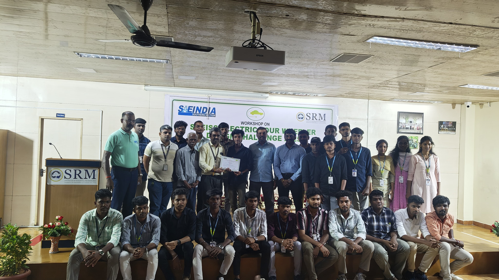

# Electric Four-Wheeler Design Challenge


## Project Overview

This repository documents **Denji Squad's** Electric Four-Wheeler prototype, built for the **Electric Four-Wheeler Design Challenge (EFWDC) 2025**, a national-level SAE India event. The vehicle is a two-seater electric four-wheeler engineered around a BLDC hub-motor drivetrain, a lithium-based battery pack, an MS (mild steel) tubular chassis, and a full engineering documentation pipeline — CAD layout, Ackermann steering geometry, suspension design, braking calculations, CAE structural analysis, and a costed Engineering Bill of Materials (E-BOM).

The project's Design Report I (Team ID: **EFWDC2025001**, Faculty Advisor: **Dr. Visagavel K**, Team Captain: **Prithivraj V**) covers the full design-to-fabrication workflow, from hand-sketched layouts through CAD modeling, powertrain simulation, and cost estimation.

## Team

[](./team_photo.jpg)

## Achievement

🥉 **Overall 3rd Place — National Level**
**SASTRA University, Thanjavur**

[](./images/Ev_certificate.jpeg)
[](./images/20251012_171456.jpg)

## My Role

**Testing & Validation Engineer / Co-Driver**

My contribution to the project centered on testing and validating the vehicle's systems and supporting on-track trial runs as co-driver. *(Detailed task-by-task testing records were not part of the design documentation reviewed for this repository; this section reflects my stated role on the team.)*

## Project Objectives

- Design and develop a lightweight, energy-efficient electric four-wheeler with a balanced cost-to-performance ratio
- Model the vehicle in CAD with accurate placement of major aggregates (battery, motor, suspension)
- Calculate and simulate critical dimensions: frame sizing, Ackermann steering geometry, and powertrain parameters
- Validate structural integrity of the chassis and suspension through CAE (Ansys) analysis
- Build a traceable Engineering BOM and realistic cost estimation
- Test and validate vehicle performance and safety ahead of competition

## Vehicle Development

| Parameter | Value |
|---|---|
| Overall length | 2500 mm |
| Front width | 1300 mm |
| Height | 1000 mm |
| Wheelbase | 2000 mm |
| Total vehicle mass (incl. rider) | 460 kg |
| Design top speed | 35 km/h |
| Wheel radius | 0.2 m |
| Seating | 2-seater |
| Chassis | MS rectangular pipe frame |
| Front suspension | Leaf spring |
| Rear suspension | Independent, dual monoshock + trailing arm |
| Steering | Ackermann geometry (inner 24.23°, outer 19.49°) |
| Brakes | Disc (stainless steel disc, organic pads, aluminium caliper) |
| Tyres | 16" rim × 4 |

> **Note:** The source design report contains some internally inconsistent figures across sections (e.g., vehicle mass appears variously as 300 kg / 450 kg / 460 kg, and wheel radius as 0.1064 m / 0.2 m). The values above reflect the most consistently repeated figures in the document.

## Electrical System

| Component | Specification |
|---|---|
| Motor | 2 × BLDC hub motors |
| Motor voltage | 48 V |
| Motor current | 45 A |
| Motor power | 2 kW per motor (4 kW total) |
| BLDC motor efficiency | 85% |
| Motor controller | Steel-housed controller unit |
| Battery voltage | 48 V |
| Battery capacity | 45 Ah |
| Battery energy | 2.16 kWh |
| Discharge rate | 45 Ah / 1h |
| Charging method | Constant Current – Constant Voltage (CCCV), simulated in MATLAB/Simulink |
| BMS | Present (Battery Management System) |
| DC-DC converter & charging port | Present |

**Motor Drive:** A three-phase inverter (6 switches) drives the BLDC motor, using Hall-effect sensor feedback for commutation logic and a PID controller for closed-loop speed regulation — modeled and simulated in Simulink.

## Testing and Validation

The project's work plan includes performance testing (acceleration, top speed, range) and safety testing (crash/safety evaluation) as planned validation stages. My role as Testing & Validation Engineer supported this validation process and vehicle trial runs as co-driver.

## Technologies / Components Used

- SolidWorks / CAD (2D & 3D layout, chassis modeling)
- Ansys 2023 R1 (static structural CAE analysis)
- MATLAB/Simulink (charging circuit and BLDC motor drive simulation)
- BLDC hub motors and controller
- Lithium-based battery pack with BMS
- MS tubular chassis with Ackermann steering, leaf-spring front / monoshock rear suspension
- Disc brake system

## Applications *(Potential)*

These are potential applications of the electric four-wheeler concept — not implemented deployments:

- Last-mile personal/campus electric mobility
- Low-speed urban commuting prototypes
- Educational platform for EV powertrain and controls learning
- Base platform for further EV research and development

## Advantages

- Lightweight tubular chassis reduces overall vehicle mass
- Dual hub-motor drive simplifies drivetrain layout (no central differential/transmission needed)
- CCCV charging protects battery health and prevents overcharging
- CAE-validated chassis design improves confidence in structural safety
- Cost-traceable E-BOM supports transparent budgeting

## Challenges

- Reconciling design targets across iterative calculation sections (e.g., mass and speed assumptions)
- Managing battery runtime within a compact 2.16 kWh pack against peak power draw
- Balancing structural strength with weight targets within budget constraints
- Coordinating a large, multi-subsystem team (steering, brakes, motor, battery, ECU, chassis) toward a unified prototype

## Future Improvements

The following are proposed future improvements, not yet implemented:

- Improved battery management and thermal monitoring
- Higher energy efficiency drivetrain components
- Better motor control (advanced PID/FOC tuning)
- Improved vehicle telemetry and data logging
- Regenerative braking integration
- Advanced safety monitoring systems
- Improved suspension/chassis integration and refinement

## Project Gallery

*(Project photos to be added here.)*

## 📁 Project Documents
[🔗 View Project Documents on Google Drive](https://drive.google.com/drive/folders/1WV_aEPP5qLE79k06lywEjXC5aTZmYVgj?usp=drive_link)

## Project Report

📄 [Full Project Report (PDF)](./project_report.pdf)

## Project Structure

```
electric-four-wheeler-design-challenge/
├── README.md
├── project_report.pdf
├── docs/
│   └── DENJI_SQUAD_DR-1.pdf        # Original Design Report I
├── images/
│   └── (project photos, CAD screenshots, certificates)
├── cad/
│   └── (CAD model files, if available)
└── calculations/
    └── (braking, steering, suspension, road-load calculation notes)
```

---

**Team Denji Squad** | Knowledge Institute of Technology (KIOT)
**Faculty Advisor:** Dr. Visagavel K | **Team Captain:** Prithivraj V
